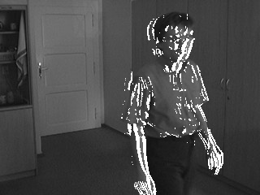
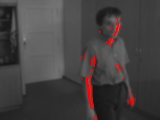

# Motion-Detection-with-Simple-Image-Filtering
This repo contains a very shallow implementation of motion detection over a series of images using simple image filtering techniques.
The explanation behind the idea and code implementation can be seen in the report file.
Some of the outputs of the motion detection from consecutive files are as below.
Also this report talks about why directly subtracting the images for motion detection is not one of the best solutions.

